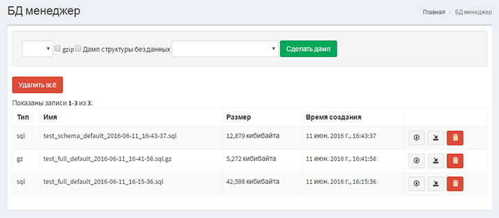

# Yii2 DB manager

Click on a :star:!

[](https://packagist.org/packages/beaten-sect0r/yii2-db-manager)
[](https://packagist.org/packages/beaten-sect0r/yii2-db-manager)
[](https://packagist.org/packages/beaten-sect0r/yii2-db-manager)
[](https://packagist.org/packages/beaten-sect0r/yii2-db-manager)

MySQL/PostgreSQL Database Backup and Restore functionality



## Installation

The preferred way to install this extension is through [composer](http://getcomposer.org/download/).

Either run

```bash
composer require --prefer-dist beaten-sect0r/yii2-db-manager "*"
```

or add

```
"beaten-sect0r/yii2-db-manager": "*"
```

to the require section of your `composer.json` file.

## Configuration

Once the extension is installed, simply add it in your config by:

Basic ```config/web.php```

Advanced ```backend/config/main.php```

## Simple config

```php
    'modules' => [
        'db-manager' => [
            'class' => 'bs\dbManager\Module',
            // path to directory for the dumps
            'path' => '@app/backups',
            // list of registerd db-components
            'dbList' => ['db'],
            'as access' => [
                'class' => 'yii\filters\AccessControl',
                'rules' => [
                    [
                        'allow' => true,
                        'roles' => ['admin'],
                    ],
            ],
        ],
    ],
```

## Advanced config

```php
    'components' => [
        // https://github.com/creocoder/yii2-flysystem
        'backupStorage' => [
            'class' => 'creocoder\flysystem\FtpFilesystem',
            'host' => 'ftp.example.com',
            //'port' => 21,
            //'username' => 'your-username',
            //'password' => 'your-password',
            //'ssl' => true,
            //'timeout' => 60,
            //'root' => '/path/to/root',
            //'permPrivate' => 0700,
            //'permPublic' => 0744,
            //'passive' => false,
            //'transferMode' => FTP_TEXT,
        ],
    ],
    'modules' => [
        'db-manager' => [
            'class' => 'bs\dbManager\Module',
            // path to directory for the dumps
            'path' => '@app/backups',
            // list of registerd db-components
            'dbList' => ['db', 'db1', 'db2'],
            // additional mysqldump/pg_dump presets (available for choosing in dump and restore forms)
            'customDumpOptions' => [
                'mysqlForce' => '--force',
                'somepreset' => '--triggers --single-transaction',
                'pgCompress' => '-Z2 -Fc',
            ],
            'customRestoreOptions' => [
                'mysqlForce' => '--force',
                'pgForce' => '-f -d',
            ],
            // options for full customizing default command generation
            'mysqlManagerClass' => 'CustomClass',
            'postgresManagerClass' => 'CustomClass',
            // option for add additional DumpManagers
            'createManagerCallback' => function($dbInfo) {
                if ($dbInfo['dbName'] == 'exclusive') {
                    return new MyExclusiveManager;
                } else {
                    return false;
                }
            }
            'as access' => [
                'class' => 'yii\filters\AccessControl',
                'rules' => [
                    [
                        'allow' => true,
                        'roles' => ['admin'],
                    ],
            ],
        ],
    ],
```

## Console config

```php
    'modules' => [
        'db-manager' => [
            'class' => 'bs\dbManager\Module',
            // path to directory for the dumps
            'path' => '@app/backups',
            // list of registerd db-components
            'dbList' => ['db'],
        ],
    ],
```

Make sure you create a writable directory named backup on app root directory.

## Usage

Pretty url's ```/db-manager```

No pretty url's ```index.php?r=db-manager```

## Console usage

```-db``` - db component, default value: `db`

```-gz``` - gzip archive

```-s``` - file storage

```-f``` - file name, default last dump

Create dump

```bash
php yii dump/create -db=db -gz -s
```

Restore dump

```bash
php yii dump/restore -db=db -s -f=dump.sql
```

Deleting all dumps

```bash
php yii dump/delete-all
```

Test database connection

```bash
php yii dump/test-connection -db=db
```

## Changelog

- [Flysystem support](https://github.com/creocoder/yii2-flysystem)
- Console support
- Multiple database management
- Ability for customize dump and restore options; dump and restore processors
- Ability for run operations asynchronously
- Ability for compressing dumps
