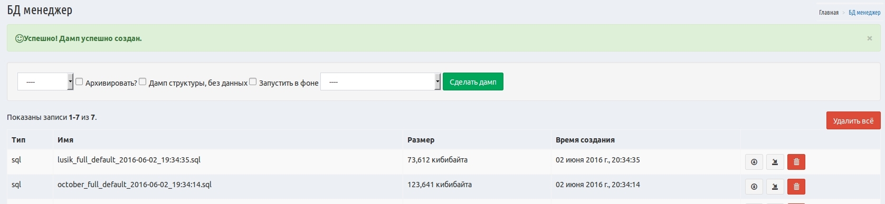

# Yii2 DB manager

MySQL/PostgreSQL Database Backup and Restore functionality



## Installation

The preferred way to install this extension is through [composer](http://getcomposer.org/download/).

Either run

```
composer require --prefer-dist beaten-sect0r/yii2-db-manager "*"
```

or add

```
"beaten-sect0r/yii2-db-manager": "*"
```

to the require section of your `composer.json` file.


## Configuration

Once the extension is installed, simply add it in your config by:

Basic ```config/web.php```

Advanced ```backend/config/main.php```

Simple config
----------
```php
'modules' => [
        'db-manager' => [
            'class' => 'bs\dbManager\Module',
            // path to directory for the dumps
            'path' => '@app/backups',
            //list of registerd db-components
            'dbList'            => ['db'],
            ],
        ]
```
Advanced Usage
-------------

```php
    'modules' => [
        'db-manager' => [
            'class' => 'bs\dbManager\Module',
            // path to directory for the dumps
            'path' => '@app/backups',
            //list of registerd db-components
            'dbList' => ['db', 'dbmysql', 'dbmysql2'],
            //additional mysqldump/pgdump presets (available for choosing in dump and restore forms)
            'customDumpOptions' => [
                'mysqlForce' => '--force',
				'somepreset' => '--triggers --single-transaction',
                'pgCompress' => '-Z2 -Fc',
            ],
            'customRestoreOptions' => [
                'mysqlForce' => '--force',
                'pgForce' => '-f -d',
            ],
            //Options for full customizing default command generation
            'mysqlManagerClass' => 'CustomClass',
            'postgresManagerClass' => 'CustomClass'
            //Option for add additional DumpManagers
            'createManagerCallback' => function($dbInfo){
                    if ($dbInfo['dbName'] == 'exclusive') {
                         return new MyExclusiveManager;
                      } else {
                         return false;
                     }
             }
        ],
    ],
```

Make sure you create a writable directory named backup on app root directory.

## Usage

Pretty url's ```/db-manager```

No pretty url's ```index.php?r=db-manager```


## Changelog:

- Multiple database management
- Ability for customize dump and restore options: dump and restore processors
- Ability for run operations asynchronously
- Ability for compressing dumps
