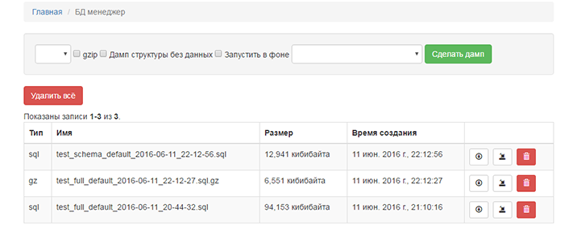

# Yii2 DB manager

Database Backup and Restore functionality



## Installation

The preferred way to install this extension is through [composer](http://getcomposer.org/download/).

Either run

```
composer require beaten-sect0r/yii2-db-manager "*"
```

or add

```
"composer require beaten-sect0r/yii2-db-manager": "*"
```

to the require section of your `composer.json` file.


## Configuration

Once the extension is installed, simply add it in your config by:

Basic ```config/web.php```

Advanced ```backend/config/main.php```

```php
    'modules' => [
        'db-manager' => [
            'class' => 'bs\dbManager\Module',
            'dsn' => $config['components']['db']['dsn'],
            'username' => $config['components']['db']['username'],
            'password' => $config['components']['db']['password'],
            'tablePrefix' => $config['components']['db']['tablePrefix'],
            // create a directory for the dumps
            'path' => Yii::$app->basePath . '/backup/', // basic
            //'path' => Yii::$app->basePath . '/../backup/', // advanced
        ],
    ],
```

Make sure you create a writable directory named backup on app root directory.

## Usage

Pretty url's ```/db-manager```

No pretty url's ```index.php?r=db-manager```
